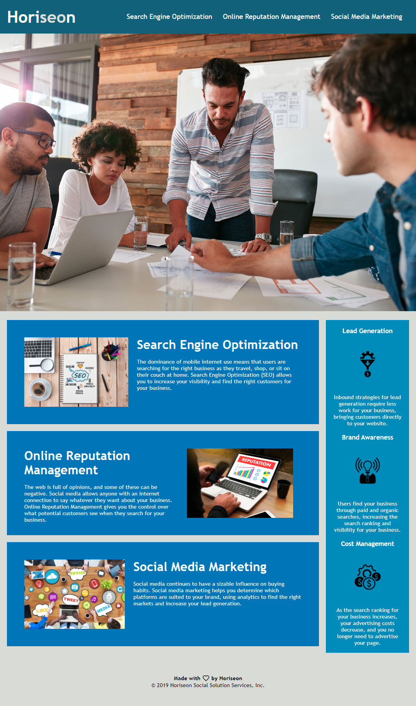

hw1 Demo Website:
=======

[Link: Horiseon Homepage](https://kashane1.github.io/hw1/)
-----------
Following the link above will bring you to a webpage that I was given as a base layer of coding. I was assigned to improve the accessability of the website, increased the functionality, and corrected the syntax. The changes I made will optimize the website for search engines.

-----------
Requirements:
-----------
```
1. Meets accessibility standards
2. Contains semantic HTML elements
3. HTML elements follow a logical structure independent of styling and positioning
4. Icon and image elements have accessible alt attributes
5. Heading attributes fall in sequential order
6. Title element is concise and descriptive
```

-----------
Process:
-----------
My intentions were to clean up the html and css file and make them more readable to next programmer. In the html file, I labeled a header and footer section so that the all the sections have more of a sequencial order. In the css file I was able to combine a lot of similar attributes. I also added more specificity to certain selectors in order to clarify which elements they will affect. A few selector were out of order, meaning they did not read top to bottom along with the html. I rearranged them to parallel the html file and I also added comments to help explain them. 

-----------
Cited:
-----------
https://www.w3schools.com/ - references to html and css
https://en.wikipedia.org/wiki/Markdown - .md syntax

some notes:
from the homework,
Important: When working with someone else's code, you should adhere to the "Scout Rule"—always leave the code a little cleaner than when you found it.
key word on that line is "cleaner"

major goal is to make an existing website meet more of the accessability criteria for all kinds of audiences. so the website can meet certain needs of certain people and be more accessible.

You can also increase the efficiency of the CSS by 
1. consolidating the selectors and properties, 
2. organizing them to follow the semantic structure of the HTML elements, and 
3. including comments before each element or section of the page.


/*
tag in the readme file a live link to the website so its easier for the graders

a lot of people flub the readme file but do the html and css files reallly well
*/


## Acceptance Criteria

```
GIVEN a webpage meets accessibility standards
WHEN I view the source code
THEN I find semantic HTML elements
WHEN I view the structure of the HTML elements
THEN I find that the elements follow a logical structure independent of styling and positioning
WHEN I view the icon and image elements
THEN I find accessible alt attributes
WHEN I view the heading attributes
THEN they fall in sequential order
WHEN I view the title element
THEN I find a concise, descriptive title
```

# also include #
Repository contains quality README file with description, screenshot, and link to deployed application.

